# Polyglot Runtime

**Execute Ruby, Python, Clojure (Squint), Scheme, Lua, and JavaScript in a
single, type‑safe interface—right from the browser or Node.js.**

<p align="center">

</p>

## ✨ Features

- **One API** – `polyglot.call(lang, code)` returns a promise in every case.
- **Runs anywhere** – Web, service workers, Electron, or Node. All engines are
  JS/WebAssembly‑backed.
- **Recursive evaluation** – Snippets can call other snippets written in
  different languages, as many levels deep as you like.
- **Zero server components** – Everything stays on the client; perfect for
  offline notebooks and teaching tools.

## Supported Languages & Engines

| Language        | Engine / Package                              |
| --------------- | --------------------------------------------- |
| JavaScript      | QuickJS WASM (`quickjs-emscripten-core`)      |
| Python          | Pyodide (`pyodide`)                           |
| Ruby            | Ruby 3.4 WASM (`@ruby/3.4-wasm-wasi`)         |
| Lua             | Wasmoon (`wasmoon`)                           |
| Scheme          | BiwaScheme (`biwascheme`)                     |
| Clojure(Script) | Squint (`squint-cljs`, `squint-cljs/core.js`) |

## Quick Start


This package is available at https://jsr.io/@tani/polyglot .


```ts
import { polyglot } from "@tani/polyglot";

// plain Python
const n = await polyglot.call("python", "sum(range(10))");
console.log(n); // 45

// a Lua snippet that calls back into Ruby which in turn runs Scheme → Clojure → JavaScript 🎢
const luaCode = `
ruby_code = [=[
python_code = <<-EOF
scheme_code = """
(define clojure-code "(* 11 13)")
(* 9 (polyglot-call "clojure" "11"))
"""
7 * await polyglot.call("scheme", scheme_code)
EOF
5 * Polyglot.call("python", python_code).await.to_i
]=]
return 3 * polyglot.call("ruby", ruby_code):await()
`;

console.log(await polyglot.call("lua", luaCode)); // → 10395
```

## API Reference

### `polyglot.call(lang, code) → Promise<unknown>` (`Polyglot.call` for ruby, `polyglot-call` for scheme)

| Parameter | Type     | Description                                                                   |
| --------- | -------- | ----------------------------------------------------------------------------- |
| `lang`    | `string` | One of `"lua"`, `"python"`, `"ruby"`, `"scheme"`, `"javascript"`, `"clojure"` |
| `code`    | `string` | The source code to execute. Multiline strings work fine.                      |

The promise resolves to the value returned by the snippet. When the underlying
engine yields a promise (Python async, JS Promise, etc.), Polyglot automatically
awaits it before returning.

## Architecture Overview

```mermaid
flowchart TD
  subgraph JS Host
    A[TypeScript] -->|imports| PJS[Polyglot]
  end
  PJS --> QJS[QuickJS‑WASM]
  PJS --> Py[Pyodide]
  PJS --> Ru[Ruby WASM]
  PJS --> Lu[Wasmoon]
  PJS --> Sc[BiwaScheme]
  PJS --> Sq[Squint]
```



> Engines live side‑by‑side; messages are shuttled through JS promises, keeping
> the main thread non‑blocking.

## Caveats / Security

- Untrusted code can freeze the tab. Run inside a **Web Worker** for isolation.
- WASI stdout/stderr are polyfilled to `console.*`; patch if you need richer IO.
- Memory limits depend on the browser—WASM instances are not sandboxed beyond
  what the host provides.

## Contributing

Love new languages? Add an adapter and submit a PR! 🛠️

## License

MIT © 2025 Masaya Taniguchi
